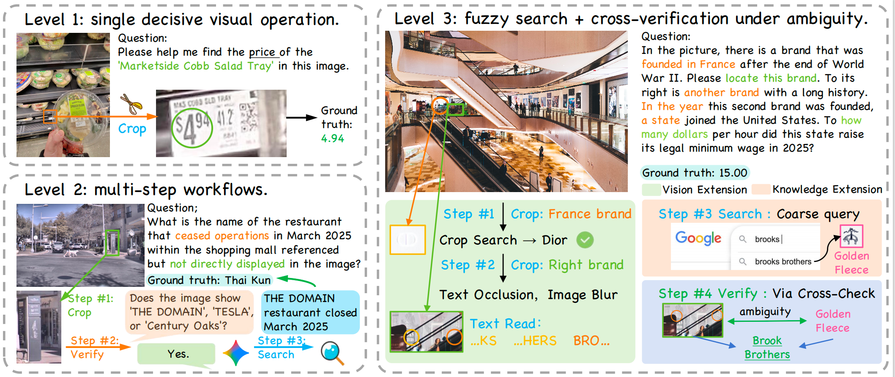

# Agentic-MME: What Agentic Capability Really Brings to Multimodal Intelligence?

This is the official repository for [***Agentic-MME***](https://arxiv.org/pdf/2604.03016), a comprehensive benchmark designed to evaluate the agentic capabilities of Multimodal Large Language Models (MLLMs). As MLLMs evolve from passive observers into active agents, they increasingly solve real-world problems through **Visual Expansion** (invoking visual tools to transform images) and **Knowledge Expansion** (leveraging open-web search). However, existing evaluations fail to capture the synergy between these capabilities or verify whether tools are actually invoked, applied correctly, and used efficiently.

Agentic-MME addresses these gaps with 418 real-world tasks across 6 domains and 3 difficulty levels, featuring over 2,000 stepwise checkpoints (averaging 10+ person-hours of manual annotation per task). Our framework supports both sandboxed code execution and structured tool APIs, enabling true process-level verification through dual-axis evaluation (S-axis for strategy, V-axis for visual operations) and an overthinkin metric relative to human trajectories.



## Key Features

- **Multi-turn Dialogue**: Models can call tools, execute code, and observe results multiple times
- **Multi-image Input**: Support for single and multi-image tasks
- **Web Search**: Integrated Google Search and Google Lens (via Serper.dev API)
- **Process Evaluation**: S/V two-axis evaluation system (Strategy, Visual)
- **Parallel Processing**: Support for multi-process parallel processing of large-scale datasets

## Running Modes

| Mode | Script | Description |
|------|--------|-------------|
| **General** | `run_general_script_*.py` | Model writes Python code freely to process images |
| **Atomic** | `run_atomic_tools_*.py` | Model calls predefined tools via function calling |

## Supported Models

| Model | Type | Configuration |
|-------|------|---------------|
| **OpenAI API** | API | `configs/api.json` |
| **Thyme** | Local (Qwen2.5-VL-7B) | `--model_path` |
| **DeepEyes** | Local (Qwen2.5-VL-7B) | `--model_path` |

## :gear: Environment Setup

To set up the environment, please follow the steps below:

```bash
git clone https://github.com/ChoS3nE11ven/Agentic-MME.git
cd Agentic-MME
conda create -n agenticmme python=3.9 -y
conda activate agenticmme
pip install -r requirements.txt
```

### For Local Models (Thyme/DeepEyes)

If you plan to use local models, install additional dependencies:

```bash
pip install torch transformers accelerate
```

### Configuration Files

Create `configs/api.json` for OpenAI API (refer to `configs/api.json.example`).

Create `configs/search_config.json` for web search functionality:
- **serper_api_key**: [Serper.dev](https://serper.dev) API key for Google Search and Google Lens
- **imgbb_api_key**: [ImgBB](https://imgbb.com) API key for uploading local images
- **jina_api_key**: [Jina Reader](https://jina.ai/reader) API key for webpage content extraction

## :rocket: Running Experiments

### General Mode

**OpenAI API:**
```bash
python general/run_general_script_openai.py \
    --task_dir ../merged/json \
    --model gpt-4o \
    --api_config configs/api.json \
    --enable_search \
    --search_config configs/search_config.json \
    --max_rounds 15 \
    --max_tool_calls 15
```

**Local Models:**
```bash
# Thyme
python general/run_general_script_thyme.py \
    --task_dir ../merged/json \
    --model_path /path/to/thyme-model \
    --enable_search \
    --search_config configs/search_config.json

# DeepEyes
python general/run_general_script_deepeyes.py \
    --task_dir ../merged/json \
    --model_path /path/to/deepeyes-model \
    --enable_search \
    --search_config configs/search_config.json
```

### Atomic Mode

**OpenAI API:**
```bash
python atomic/run_atomic_tools_openai.py \
    --task_dir ../merged/json \
    --api_config configs/api.json \
    --enable_search \
    --search_config configs/search_config.json
```

**Local Models:**
```bash
# Thyme
python atomic/run_atomic_tools_thyme.py \
    --task_dir ../merged/json \
    --model_path /path/to/thyme-model \
    --enable_search

# DeepEyes
python atomic/run_atomic_tools_deepeyes.py \
    --task_dir ../merged/json \
    --model_path /path/to/deepeyes-model \
    --enable_search
```

### Key Arguments

| Argument | Default | Description |
|----------|---------|-------------|
| `--task_dir` | - | Task JSON directory |
| `--task_json` | - | Single task file (alternative to task_dir) |
| `--model` | gpt-4.1 | Model name (OpenAI API) |
| `--model_path` | - | Local model path (Thyme/DeepEyes) |
| `--api_config` | - | API configuration file path |
| `--enable_search` | false | Enable web search |
| `--search_config` | - | Search configuration file path |
| `--max_rounds` | 15 | Maximum dialogue rounds |
| `--max_tool_calls` | 15 | Maximum tool calls |
| `--shard` | - | Shard index (for parallel processing) |
| `--num_shards` | - | Total number of shards |
| `--skip_existing` | false | Skip completed tasks |

### Parallel Processing

Manually launch multiple processes with different shard indices:

```bash
python general/run_general_script_openai.py --shard 0 --num_shards 8 ... &
python general/run_general_script_openai.py --shard 1 --num_shards 8 ... &
# ... launch remaining shards
```

## :bar_chart: Evaluation

### Run Evaluation

```bash
python evaluation/eval_runs_search.py \
    --runs_dir runs/general/gpt-5 \
    --api_config configs/api.json
```

### Evaluation Dimensions

This framework uses an **S-V two-axis evaluation system**:

#### S-axis (Strategy) - Strategy Correctness

Checks if the model used the correct search tools.

**S-axis tools:**
- `google_search`: Text search
- `google_lens_search`: Reverse image search

#### V-axis (Visual) - Visual Verification

Checks if the processed images or visual tool calls meet expectations. V-axis has two types:

**1. Tool-use Checkpoints**

Checks if the correct visual processing tools were called.

**V-axis visual tools:**
- `crop`: Crop image
- `enhance`: Enhance image
- `resize`: Resize image
- `rotate`: Rotate image
- `flip`: Flip image

**2. Visual-check Checkpoints**

Uses a judge model to evaluate if generated images meet expectations.

### V-axis Analysis

Use `analyze_v.py` to analyze V-axis checkpoint pass rates:

```bash
python evaluation/analyze_v.py <scored_json_path> [task_config_dir]
```

## :wrench: Available Tools

### Image Processing Tools (Atomic Mode)

| Tool | Description |
|------|-------------|
| `crop` | Crop image region using normalized coordinates |
| `rotate` | Rotate image by specified angle |
| `flip` | Flip image (horizontal/vertical/both) |
| `resize` | Resize image to specified dimensions |
| `enhance` | Adjust brightness, contrast, sharpness |
| `grayscale` | Convert to grayscale |
| `autocontrast` | Auto contrast adjustment |
| `blur` | Apply Gaussian blur |
| `sharpen` | Sharpen image |
| `denoise` | Remove noise |
| `edge_detect` | Edge detection (canny/sobel/simple) |
| `invert` | Invert colors |
| `equalize` | Histogram equalization |
| `threshold` | Binarization |

### Search Tools

| Tool | Description |
|------|-------------|
| `google_search` | Text-based web search |
| `google_lens_search` | Reverse image search |
| `fetch_webpage` | Fetch webpage content |

**Note:** `bbox_2d` uses normalized coordinates `[x1, y1, x2, y2]` with range 0-1000, where `(0, 0)` is top-left and `(1000, 1000)` is bottom-right.

## :file_folder: Output Files

Each task's results are saved in `runs/{mode}/{model}/{task_id}/`:

| File | Description |
|------|-------------|
| `orig.png` | Original input image(s) |
| `tool_images/` | Processed images directory |
| `model_answer.txt` | Model's final answer |
| `conversation.json` | Complete conversation history |
| `tool_use_list.json` | Tool call records |
| `run_meta.json` | Run metadata |
| `raw_model_output_turn_*.txt` | Raw output per turn |
| `model_code_turn_*.py` | Executed code per turn (General mode) |

## :hammer_and_wrench: Utility Scripts

### Data Processing

```bash
# Aggregate results from multiple shards
python evaluation/aggregate_shards.py --runs_dir runs/general/gpt-4o

```

### Evaluation & Analysis

```bash
# Main evaluation script (S/V two-axis)
python evaluation/eval_runs_search.py --runs_dir runs/general/gpt-4o --api_config configs/api.json

# V-axis checkpoint statistics
python evaluation/analyze_v.py scored_runs/general/gpt-4o_scored.json ../merged/json
```

## Project Structure

```
think_with_image_pipeline_v4_updated_multiturn/
├── atomic/                        # Atomic mode scripts
│   ├── run_atomic_tools_openai.py    # OpenAI API
│   ├── run_atomic_tools_thyme.py     # Thyme local model
│   └── run_atomic_tools_deepeyes.py  # DeepEyes local model
├── general/                       # General mode scripts
│   ├── run_general_script_openai.py  # OpenAI API
│   ├── run_general_script_thyme.py   # Thyme local model
│   └── run_general_script_deepeyes.py # DeepEyes local model
├── evaluation/                    # Evaluation scripts
│   ├── eval_runs_search.py           # Main evaluation (S/V two-axis)
│   ├── analyze_v.py                  # V-axis checkpoint statistics
│   └── aggregate_shards.py           # Aggregate shard results
├── configs/                       # Configuration files
│   ├── api.json.example              # API config example
│   └── search_config.json            # Search config
├── run_notool_openai.py           # NoTool mode baseline
├── common_utils.py                # Common utilities
├── dataset_utils.py               # Dataset loading utilities
├── ast_ops.py                     # AST code analysis
├── atomic_toolbox.py              # Atomic mode tool definitions
├── search_toolbox.py              # Search tools schema
├── search_tools.py                # Search tool implementation
├── verifiers.py                   # Checkpoint verifiers
└── requirements.txt               # Dependencies
```

## :page_with_curl: Citation
If you find our work useful in your research, please consider citing:

```bibtex
@article{wei2026agenticmme,
  title={Agentic-MME: What Agentic Capability Really Brings to Multimodal Intelligence?},
  author={Qianshan Wei and Yishan Yang and Siyi Wang and Jinglin Chen and Binyu Wang and Jiaming Wang and Shuang Chen and Zechen Li and Yang Shi and Yuqi Tang and Weining Wang and Yi Yu and Chaoyou Fu and Qi Li and Yi-Fan Zhang},
  journal={arXiv preprint arXiv:2604.03016},
  year={2026}
}
```